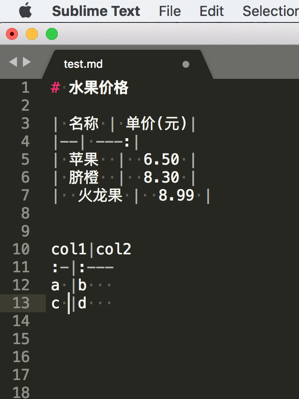
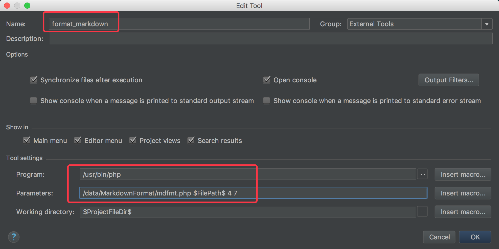
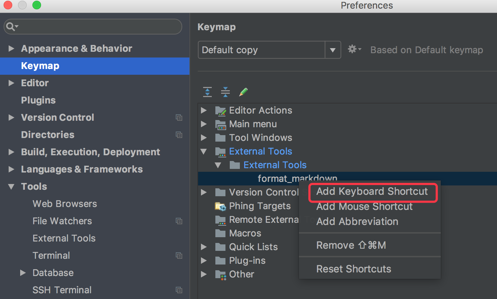
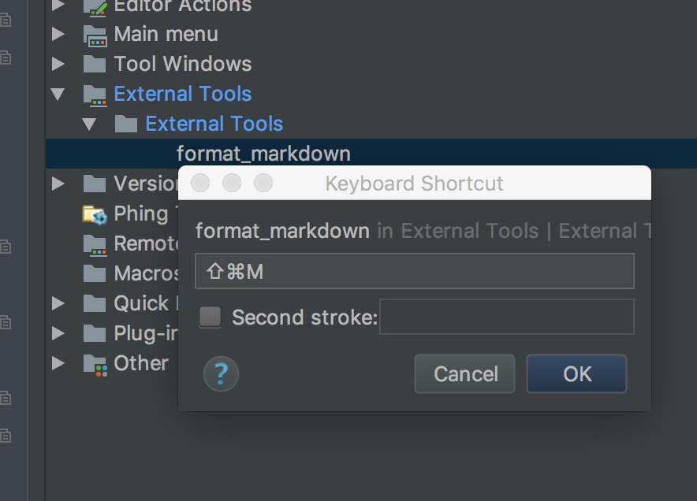

# MarkdownFormat
Format the markdown table in any editor that supports an external command

# 格式化markdown表格的工具
- 支持utf-8, 需要等宽字体
- 支持任意可自定义外部命令的编辑器
- php编写, 运行时需要php引擎

# 效果



# sublime text3 中安装使用
1.下载文件(以mac系统为例, 假设安装在`/data/`目录下)
```bash
cd /data
git@github.com:zh-five/MarkdownFormat.git
```

2.在sublime text3中, 为markdown文档配置一条build命令
选择 `Tools` > `Build System` > `New Build System...` 
打开文件后, 复制以下内容写入
```
{
    "shell_cmd": "php /data/MarkdownFormat/mdfmt.php $file 3 5;",
    //若你安装的php在命令行下不能直接调用, 可以使用绝对路径,如:
    //"shell_cmd": "/usr/bin/php /data/MarkdownFormat/mdfmt.php $file 3 5;",
    
    //文档选择器, 限制为只对markdown文档有效
    "selector": "text.html.markdown" 
}
```
直接保存文件在默认的目录中, 取名为`md-fmt.sublime-build`, `.sublime-build`部分不要修改, 
前面的文件名可以改为你喜欢的.

3.使用

把以下内容粘贴到sublime text3中, 保存为`test.md`, 然后按快捷键`command + b`即可格式化表格让其对齐
```text
# 水果价格

| 名称 | 单价(元)|
|--| ---:|
| 苹果  |  6.50 |
| 脐橙  |  8.30 |
|  火龙果 |  8.99 |


col1|col2
:-|:---
a |b   
c |d   
```

# phpstorm 中安装使用
1.下载文件(以mac系统为例, 假设安装在`/data/`目录下)
```bash
cd /data
git@github.com:zh-five/MarkdownFormat.git
```

2.在phpstorm中配置一条扩展命令

`PhpStorm` > `Preferences...` > `Tools` > `External Tool` 点击右侧区域左下角`+`号


在打开*.md文件时, 从顶部菜单运行刚才配置的命令即可格式化, `Tools` > `External Tool` > `formatmarkdown`

3. 配置快捷键



# 其它一些问题

为例精确计算字符串的宽度, 进行对齐. 你的编辑必须使用等宽字体. 但同一中等宽字体, 在不同的编辑器里宽度是不一样的.
例如在我的sublime text3中, 3个汉字的宽度与5个空格宽度完全相等, 所以配置的命令为
`php /data/MarkdownFormat/mdfmt.php $file 3 5`

而在我的phpstorm中, 是4个汉字与7个空格完全相等, 所以配置的命令为
`/data/MarkdownFormat/mdfmt.php $FilePath$ 4 7`

因为系统、编辑器和字体不同，你可以用下面的方法精确找出字体的宽度
在你的编辑器里输入以两行字符，都使用`|`结束，第一行逐渐增加汉字，第二行输入数字调整`|`位置，当竖线垂直方向完全对齐
时，汉字个数和数字个数分别就是命令末尾的两个参数
```text
汉字汉字|
1234567|
```

注意, 编辑器一定要设为等宽字体, 格式化工具才能正常工作. (不过编辑器的默认字体一般都是等宽字体)
若还有其它问题, 请留言.

